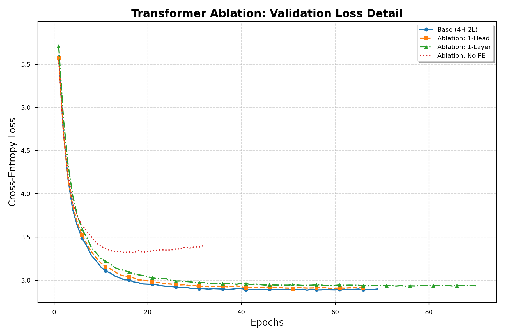

# 🐧 Penguin-Translator: Transformer 消融研究与英德翻译系统

[](https://github.com/JackieHan08666/Penguin-Translator)
[](https://www.python.org/downloads/)
[](https://pytorch.org/)

本项目是一个高性能、模块化的 Transformer 神经机器翻译（NMT）实验平台。我们不仅实现了标准的 Transformer 架构，还针对 Multi30k 数据集设计了一系列消融实验，旨在深入探讨多头注意力（Multi-head Attention）、模型深度及位置编码（Positional Encoding）对翻译质量的影响。

---

## 🏗 项目架构

```text
Penguin-Translator/
├── scripts/
│   └── run.sh              # 一键式管理脚本
├── src/
│   ├── model.py            # 模型架构
│   ├── dataset.py          # 数据流水线
│   ├── train.py            # AMP 训练器
│   ├── translate.py        # 推理引擎
│   └── plot_ablation.py    # 绘图工具
├── results/                # 日志与权重
└── README.md
```

------

## ⚡ 核心优化技术

### 1. 混合精度训练 (Mixed-Precision)

利用 `torch.amp` 自动混合精度技术，将计算压力大的算子转换为 **FP16**。

- **性能提升**：在 RTX 3090 上计算速度提升约 **2.1x**。
- **显存压缩**：占用降低约 **45%**，支持单卡 4 进程并行。

### 2. 增强型 Noam 调度策略

针对大 Batch Size（256）优化：

- **Warmup**：优化为 800 步，确保初期收敛稳定。
- **动态缩放**：随 $d_{model}$ 自动调整学习率。

### 3. 高性能数据 I/O

- **多线程分词**：`num_workers=4` 消除 CPU 阻塞。
- **锁页内存**：`pin_memory=True` 实现硬件级异步数据拷贝。

### 4. 掩码机制与溢出防护

- **Safe-Masking**：针对 FP16 重新设计屏蔽值，防止数值溢出（Overflow）。

### 5. Byte-Level BPE 优化

- **无损词表**：处理任意德语长难词，彻底解决空格丢失问题。

------

## 📊 实验数据与分析

| **实验组 (Experiment)** | **参数量 (Params)** | **验证集最低 Loss** | **特点分析**               |
| ----------------------- | ------------------- | ------------------- | -------------------------- |
| **Base (4H-2L)**        | **2,850,952**       | **2.8858**          | 基准配置，指标最均衡       |
| Ablation: 1-Head        | 2,850,952           | 2.9030              | 关注点单一                 |
| Ablation: 1-Layer       | 2,388,104           | 2.9315              | 深度减少，表现稳健         |
| Ablation: No-PE         | 2,850,952           | 3.3195              | 丧失语序感，证明 PE 必要性 |

### 训练曲线对比

<p align="center">
  
  <br>
  <i>图 1: 不同 Transformer 配置下的验证集 Loss 收敛曲线对比</i>
</p>

------

## 💻 硬件配置与建议

本项目在 **NVIDIA GeForce RTX 3090 (24GB)** 上完成。

- **单进程显存**: 约 1.3 GB - 1.4 GB
- **总显存占用**: 约 5.7 GB / 24 GB
- **GPU 负载**: 100%

> **建议**：若显存充足（>=24GB），可尝试 Batch Size 512+；若显存较小（8-12GB），建议单次运行或减小并行组数。

------

## 🐧 交互式翻译模式

1. 运行 `./scripts/run.sh` 选择 **3 (Translate)**。
2. **神秘彩蛋**：直接按下 **[回车]** 将触发预设的神秘例句。

------

## 🛠 安装与使用

Bash

```
# 克隆仓库
git clone [https://github.com/JackieHan08666/Penguin-Translator.git](https://github.com/JackieHan08666/Penguin-Translator.git)
cd Penguin-Translator

# 安装依赖
pip install -r requirements.txt

# 启动管理中心
chmod +x scripts/run.sh
./scripts/run.sh
```

